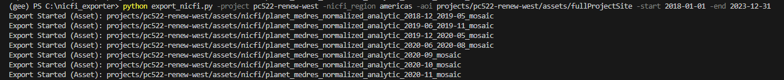

# nicfi_exporter
command-line tool to export subsets of Planet NICFI analytical basemaps to new GEE assets

## Quickstart

Using your Shell window application of choice:

Install earthengine-api from conda
```
conda install -c conda-forge earthengine-api
```

### Authenticate to earthengine using your Google account
```
earthengine authenticate
```
Follow the prompts in the browser pop-up to save a credentials key to your computer

### Using the CLI script

Use the CLI help to understand what the required arguments are
```
python export_nicfi.py -h
```

Then run it with your desired options
```
python export_nicfi.py -project pc522-renew-west -nicfi_region americas -aoi projects/pc522-renew-west/assets/fullProjectSite -start 2018-01-01 -end 2023-12-31
```

CLI Output



All Planet NICFI images in your chosen NICFI collection, AOI, and date range will be exported to a new ee.ImageCollection, clipped to your AOI


